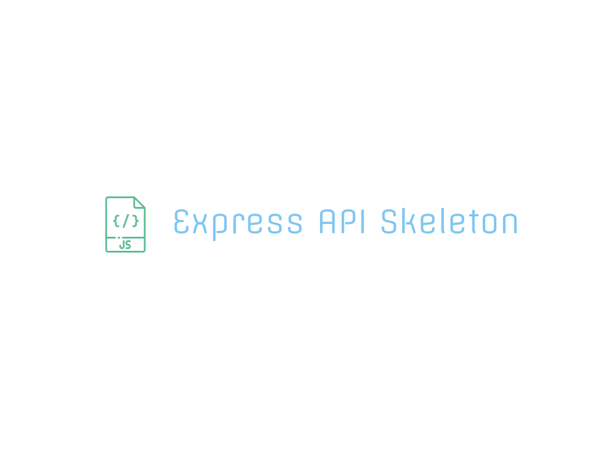

# About
"EAS" is an bare skeleton, lightweight framework for designing a RESTful API. The framework is built off the npmjs package, Express. Deployable out of box, though the only available default routes are 
- /c
- /r
- /u
- /d

If you navigate to any of these routes, you will be sent a JSON response of **This is not a valid API route!**.  This is intended as there is not an APIHandler route implementation.


## Getting Started
To get started, create an implementation of ```APIHandler``` in **/controllers**.
```
import APIHandler from "./api-handler.js";

class MyFirstApi extends APIHandler {

    handleCreate = (request, response) => {
        response.json({
            message: 'This is the create route handler!'
        })
    }

    handleRead = (request, response) => {
        response.json({
            message: 'This is the read route handler!'
        })
    }

    handleUpdate = (request, response) => {
        response.json({
            message: 'This is the update route handler!'
        })
    }

    handleDelete = (request, response) => {
        response.json({
            message: 'This is the delete route handler!'
        })
    }
}

export default new MyFirstApi();
```

Once you have an implementation, you can use the handler methods in a **CRUD** route. As an example, define the following in the ```ROUTES()```**function of /routes/read.js**

```
READ_ROUTER.get('/api', MyFirstApi.handleRead);
```

Now, if you run the express server and navigate to http://localhost:3000/r/api you should see a response in the browser like below.

```
{
  "message": "This is the read route handler!"
}
```

NOTE - This project is a work in progress and was built in an effort to further my own knowledge in JS. 
## Tech Stack


[](https://skillicons.dev)


## Deployment

To deploy this project run

```bash
  npm start
```

